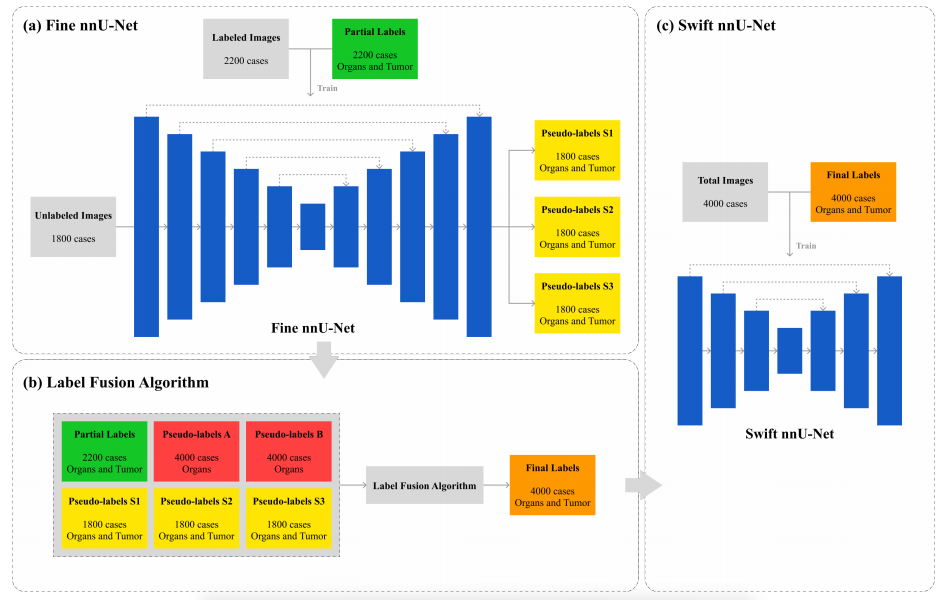

# Multi-Organ and Pan-cancer Segmentation Framework from Partially Labeled Abdominal CT Datasets: Fine and Swift nnU-Nets with Label Fusion

Framework of our solution:


This repository offers the solution by Team snuhmedisc for the [MICCAI FLARE23 Challenge](https://codalab.lisn.upsaclay.fr/competitions/12239).

Further details of our method can be found in our paper: **[Multi-Organ and Pan-cancer Segmentation Framework from Partially Labeled Abdominal CT Datasets: Fine and Swift nnU-Nets with Label Fusion](https://openreview.net/pdf?id=6IUTVrtDAw)**.

Our work builds upon [nnU-Net](https://github.com/MIC-DKFZ/nnUNet/tree/nnunetv1) (nnunetv1). You can get our docker by:
```bash
docker pull **~**
```

## Environments and Requirements

This repo is based on MIC-DKFZ/nnUNet. The requirements of nnU-Net should be satisfied, and our method doesn't demand any additional requirements. More details can be found at [nnU-Net's repository](https://github.com/MIC-DKFZ/nnUNet) (specifically the 'nnunetv1' branch).

To set up, follow:

```bash
git clone https://github.com/YoungKong/MICCAI-FLARE23.git
cd MICCAI-FLARE23
pip install -e .
path.sh
```

## Dataset

The training dataset includes 4,000 images: 2,200 partially labeled and 1,800 unlabeled. Two sets of pseudo-labels, each containing 4,000 images, were sourced from FLARE22. Additionally, there's a 100-image validation set and a 400-image test set. 

Download the dataset [here](https://codalab.lisn.upsaclay.fr/competitions/12239#learn_the_details-dataset).

## 1. Generate Pseudo-labels with Fine nnU-Net

### 1.1 Dataset conversion

Following nnU-Net, give a TaskID (e.g. Task023) to the 2200 partially labeled data and organize them following the requirement of nnU-Net.
```bash
nnUNet_raw_data/Task023_FLARE23/
├── dataset.json
├── imagesTr
├── imagesTs
└── labelsTr
```

### 1.2 Data Preprocessing

Preprocess the data with the settings we set as Fine nnU-Net. The preprocessing cropped the image to include crucial regions or regions of interest, resampling to ensure that all image pixels were equally spaced according to the target spacing, and normalization to ensure consistency in the intensity range of pixels in the image. 

Running the data preprocessing code:
```bash
nnUNet_plan_and_preprocess -t 23 -pl3d ExperimentPlanner3D_FLARE23Fine -pl2d None
```

### 1.3 Train Fine nnU-Net with partial labels

You can train the Fine nnU-Net. In our work, we trained with the 2200 partially labeled data, also you can train with 5-fold.

To train the Fine nnU-Net in the paper, run this command:
```bash
nnUNet_train 3d_fullres nnUNetTrainerV2_FLARE_Fine 23 all -p nnUNetPlansFLARE23Fine
```

### 1.4 Generate Pseudo-labels for 1800 Unlabeled Data

You can generate Pseudo-labels S1, S2, S3 for 1800 unlabeled pieces of data.
```bash
nnUNet_predict -i INPUTS_FOLDER -o OUTPUTS_FOLDER  -t 23  -tr nnUNetTrainerV2_FLARE_Fine  -m 3d_fullres  -p nnUNetPlansFLARE23Fine  --all_in_gpu True  -f all -chk 'YOUR_MODEL'  --mode fastest
```
If you use the label fusion algorithm, you will need to generate pseudo labels 3 times due to the voting system. You need to place the 1800 unlabeled data with pseudo-labeling into their respective directories for Label Fusion. You should rename ‘.pkl, .model’ files as you want. And fill out command -chk ‘model name‘ as shown below.
```bash
nnUNet_predict -i INPUTS_FOLDER -o LabelFusion/Unlabeled/Pseudo_S1_1800  -t 23  -tr nnUNetTrainerV2_FLARE_Fine  -m 3d_fullres  -p nnUNetPlansFLARE23Fine  --all_in_gpu True  -f all -chk 'model_ep_0900'  --mode fastest
```
```bash
nnUNet_predict -i INPUTS_FOLDER -o LabelFusion/Unlabeled/Pseudo_S2_1800  -t 23  -tr nnUNetTrainerV2_FLARE_Fine  -m 3d_fullres  -p nnUNetPlansFLARE23Fine  --all_in_gpu True  -f all -chk 'model_ep_0950'  --mode fastest
```
```bash
nnUNet_predict -i INPUTS_FOLDER -o LabelFusion/Unlabeled/Pseudo_S3_1800  -t 23  -tr nnUNetTrainerV2_FLARE_Fine  -m 3d_fullres  -p nnUNetPlansFLARE23Fine  --all_in_gpu True  -f all -chk 'model_ep_1000'  --mode fastest
```

## 2. Create training dataset for Swift nnU-Net with Label Fusion Algorithm

Perform label fusion on each of the labeled and unlabeled images.

### 2.1 For 2200 Labeled Images

With the file structure below, run the following command:
```bash
LabelFusion/Labeled/
├── LabelFusion_2200.py
├── Pseudo_A_2200
├── Pseudo_B_2200
├── Partial_2200
└── Output_2200
```
```bash
python LabelFusion_2200.py
```

### 2.2 For 1800 Unlabeled Images

With the file structure below, run the following command:
```bash
LabelFusion/Unlabeled/
├── LabelFusion_1800.py
├── Pseudo_A_1800
├── Pseudo_B_1800
├── Pseudo_S1_1800
├── Pseudo_S2_1800
├── Pseudo_S3_1800
└── Output_1800
```
```bash
python LabelFusion_1800.py
```

## 3. Train Swift nnU-Net

### 3.1 Dataset conversion

Prepare 2200 pseudo-labels and 1800 pseudo-labels generated using the Label Fusion Algorithm, for a total of 4000 labels. And give a new TaskID (e.g. Task024) and organize the 4000 Pseudo Labeled Data as above.

### 3.2 Data Preprocessing

Preprocess the data with the settings we set as Swift nnU-Net.
```bash
nnUNet_plan_and_preprocess -t 24 -pl3d ExperimentPlanner3D_FLARE23Swift -pl2d None 
```

### 3.3 Train Swift nnU-Net with 4,000 pseudo-labels

You can train the Swift nnU-Net. In our work, we trained with the 4000 pseudo-labeled data, also you can train with 5-fold.

To train the Swift nnU-Net in the paper, run this command:
```bash
nnUNet_train 3d_fullres nnUNetTrainerV2_FLARE_Swift 24 all -p nnUNetPlansFLARE23Swift
```

## 4. Inference with Swift nnU-Net

Finally perform multi-organ and tumor segmentation using Swift nnU-Net
```bash
nnUNet_predict -i INPUTS_FOLDER -o OUTPUTS_FOLDER  -t 24  -tr nnUNetTrainerV2_FLARE_Swift  -m 3d_fullres  -p nnUNetPlansFLARE23Swift  --all_in_gpu True   -f all  --mode fastest  --disable_tta
```

## Results

Our method's performance on the [MICCAI FLARE23 Challenge](https://codalab.lisn.upsaclay.fr/competitions/12239) is as follows:


| Target              | Public Validation DSC(%) | Public Validation NSD(%) | Online Validation DSC(%) | Online Validation NSD(%) |
|---------------------|--------------------------|--------------------------|---------------------------|---------------------------|
| Liver               | 97.42 ± 0.68             | 98.63 ± 1.67             | 97.23                     | 98.28                     |
| Right Kidney        | 94.16 ± 6.89             | 93.81 ± 8.89             | 93.39                     | 92.82                     |
| Spleen              | 96.37 ± 2.21             | 97.42 ± 5.09             | 95.99                     | 97.37                     |
| Pancreas            | 85.74 ± 5.42             | 96.84 ± 4.77             | 84.26                     | 95.82                     |
| Aorta               | 94.96 ± 3.05             | 98.63 ± 3.21             | 95.31                     | 98.95                     |
| Inferior vena cava  | 91.84 ± 4.06             | 94.39 ± 4.58             | 91.55                     | 93.98                     |
| Right adrenal gland | 88.05 ± 4.04             | 98.60 ± 1.54             | 87.20                     | 98.25                     |
| Left adrenal gland  | 87.94 ± 3.45             | 98.00 ± 2.33             | 86.65                     | 96.69                     |
| Gallbladder         | 83.12 ± 24.77            | 84.58 ± 26.01            | 82.02                     | 83.18                     |
| Esophagus           | 80.76 ± 16.32            | 91.47 ± 15.71            | 81.54                     | 92.50                     |
| Stomach             | 92.83 ± 4.78             | 95.32 ± 6.71             | 93.23                     | 95.92                     |
| Duodenum            | 82.31 ± 7.41             | 94.65 ± 5.33             | 82.90                     | 94.93                     |
| Left kidney         | 92.45 ± 9.56             | 91.48 ± 11.93            | 92.96                     | 92.06                     |
| Tumor               | 38.38 ± 32.01            | 27.61 ± 25.53            | 35.70                     | 25.52                     |
| Organs Average      | 89.84 ± 8.70             | 94.90 ± 7.60             | 89.56                     | 94.67                     |
| Total Average       | 86.17 ± 17.65            | 90.10 ± 20.61            | 85.71                     | 89.73                     |

## Contributing

> Choose a license and describe the contribution guidelines for this code repository.

## Acknowledgements

We declare that the segmentation method we implemented for participation in the FLARE 2023 challenge has not used any pre-trained models nor additional datasets other than those provided by the organizers. The proposed solution is fully automatic without any manual intervention. We thank all the data owners for making the CT scans publicly available and CodaLab for hosting the challenge platform. This work was supported by Institute of Information & communications Technology Planning & Evaluation (IITP) grant funded by the Korea government(MSIT) (No. 2021-0-0052, Cloud-based XR content conversion and service technology development that changes according to device performance) and Institute of Information and Communications Technology Planning and Evaluation (IITP) grant funded by the Korea Government (MSIT) (No. 2021-0-00312, development of non-face-to-face patient infection activity prediction and protection management SW technology at home and community treatment centers for effective response to infectious disease).

## Citations

```
Your Conference Paper Citation Here
```
